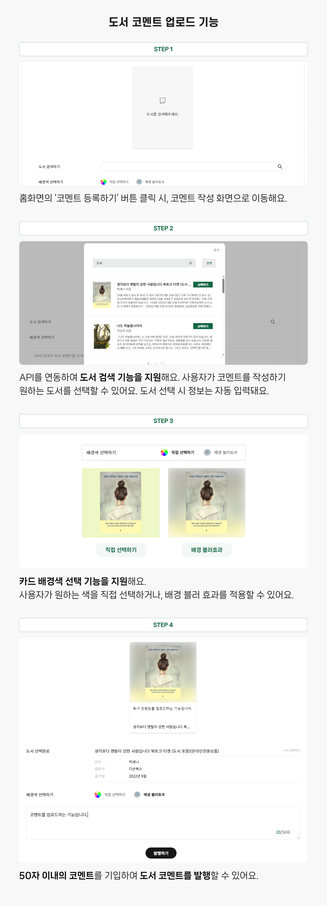
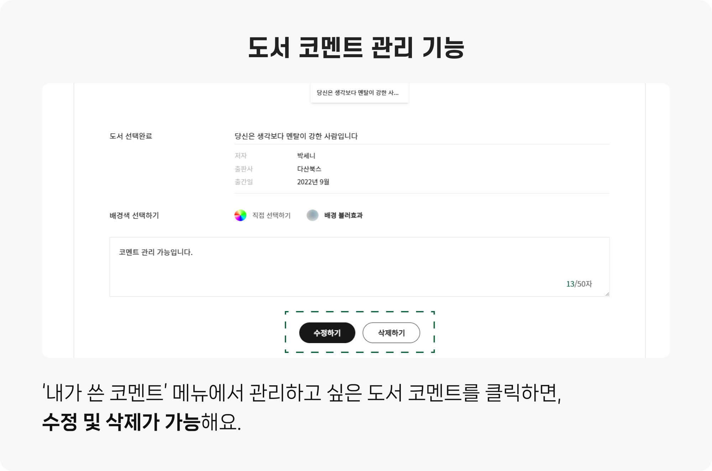

<div align="middle" >
  
  <p>독서를 즐겨하는 사람들이 모여 제작한 “도서 코멘트” 서비스에 프론트엔드 개발자로 참여했습니다.</p>
</div>

## 1. 시작하기

```YAML
# 프로젝트를 로컬 환경에 복제합니다.
$ git clone https://github.com/first-person-library/first-person-library.git

# 다음 명령을 실행하여 필요한 패키지를 설치합니다.
$ npm install

# 다음 명령으로 개발 서버를 시작합니다.
$ npm run dev
```

프로젝트 루트 디렉토리에 `.env` 파일을 생성하고, 아래와 같이 환경 변수를 설정합니다.

```sql
VITE_KAKAO_API_KEY=0da8c384440600d56cb9982acf2fe10e
VITE_FIREBASE_API_KEY=...
VITE_FIREBASE_AUTH_DOMAIN=...
VITE_FIREBASE_DB_URL=...
VITE_FIREBASE_PROJECT_ID=...
```

Firebase Config Key는 노출하지 않음.

## 2. 사용한 기술

- Front-End: React, TypeScript, Tailwind CSS
- Back-End: Firebase
- Deployment: Vercel, Netlify

## 3. 주요 기능

### 3.1 도서 코멘트 공유


### 3.2 도서 코멘트 업로드



### 3.3 코멘트 관리



## 4. 저작권 표시

### 4.1. Kakao Developers API

- 도서 검색을 위해 사용했습니다.
- API 문서: [Kakao Developers API 문서](https://developers.kakao.com/docs/latest/ko/daum-search/dev-guide#search-book)
- 제공: Kakao Developers (https://developers.kakao.com/)

### 4.2. Firebase Realtime Database

- 실시간 데이터 동기화와 저장소로 사용되었습니다.
- Firebase 실시간 데이터베이스 문서: [Firebase 실시간 데이터베이스 문서](https://firebase.google.com/docs/database)
- 제공: Firebase (https://firebase.google.com/)
